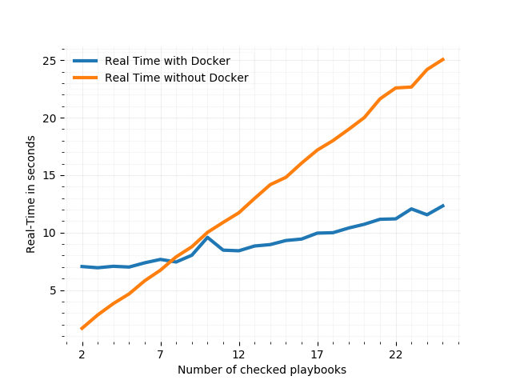
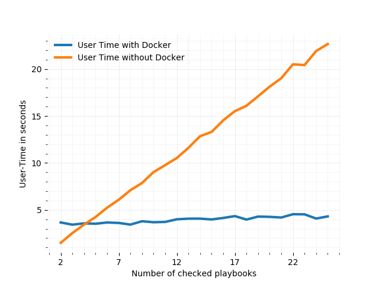
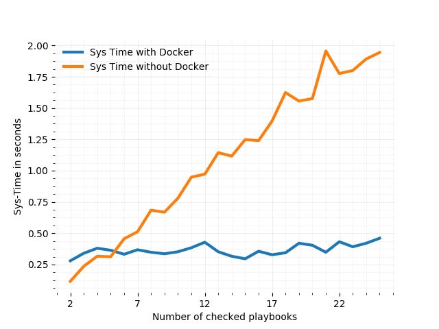

Automated static code analysis with pre-commit git hooks
========================================================

This repository demonstrates the usage of [git hooks for
syntax-checking](https://medium.com/@david_28274/automated-pre-commit-code-checks-with-and-without-docker-b4a6ccf249ce) Ansible playbooks before they are committed.

The example pre-commit hook script in `src/nodocker` runs an `ansible-playbook --check`
command for each playbook that has been added or modified since the last commit.

The example pre-commit hooks script in `src/withdocker` does the same,
but parallelizes these checks with the help of docker containers.

The rest of this `Readme` provides a guide through the setup of such a hook
and outlines some implementation details and lessons learned.

Goal
====
Whenever we change a playbook in our repository,
it will be sanity-checked automatically by a script
that is triggered once we run ``git commit``.

If the check fails, the commit will be aborted.

If the check succeeds, the editor for entering
your commit message will be opened and you can
finish the commit.

Still confused? I don't blame you. Maybe my [the article I wrote about this topic](https://medium.com/@david_28274/automated-pre-commit-code-checks-with-and-without-docker-b4a6ccf249ce) will help: 

Installing a pre-commit git hook
================================
To install a pre-commit git hook,
copy the executable that is to be called
once the user starts a ``git commit`` to ``.git/hooks/pre-commit``
and make it executable.

Id you want to try out the hooks provided in this repository,
go into the ``src`` folder and then either into the ``nodocker`` or ``withdocker``
subfolder.

If you want to install either of the git hooks on this demo repository
simly run

.. code::

    make setup

in one of the sub-folders. If you want to install them on your own repository
open the according ``Makefile`` and change the ``GIT_PROJECT_ROOT``
to the local root folder of your git repository.

Note that the hook that works with docker, copies a couple of additional files
into the ``.git/hooks`` folder.

To docker or not to docker
==========================

As mentioned above, one of the example hooks makes use of docker in order
to allow the parallel execution of the playbook syntax checks.
The question arising here is: Is it worth it?
And the answer is (spoiler alert): It depends, but probably not.

I performed bench marks which had the hook scripts perform checks on up to
25 playbooks. As you can see in the graphics below, the usage of docker
provides a significant performance improvement, but only as of a quantity
of 7 playbooks that are to be verified. Which means: If you are committing
less than 8 playbooks at once, you are probably better off not using docker.

From my personal experience, one commit usually entails the change of
between 1 and 3 playbooks, and for those numbers, docker performs pretty badly.

Now wait. Before we disregard docker completely, there are things to considere here.
First: The main reason why docker performed so badly here, is because of overhead
from `docker-compose`. If you have a look inside the benchmark folder from
the 27th of March, you can see that docker performed significantly better here
even for low quantities of playbook checks. For this particular banchmark,
I used a Go tool I wrote myself, which directly interacts with the docker API.
The reason I took it out of this repository again is, because I don't feel
it is work maintaining and distributing a separate tools just for a few seconds
of performance improvement on pre-commit checks.

What I'm getting at, is: If you tweak the way you use docker a bit, it can make
for tremendous performance improvements, but since git pre-commit hooks
are something very lightweight, one should ask the question of whether
it is worth the effort or if it just complicates this otherwise very simple
matter.

Testing it
==========
Now let's test this contraption.

Let's just consider this demo repository here.
If you haven't done so yet, install one of the git hooks for this
example repository (see
`Installing a pre-commit git hook`_).

The freshly cloned repository contains two playbooks in the ``example`` folder
which are both healthy.
If you were to run a ``git commit`` right now, neither of them would be checked, though, as they haven't changed
since the last commit.

Open one of the playbooks with a text editor and make the syntax invalid, e.g. by removing one of the many colons
(Remember it's a yaml file).

Exit the texteditor and ``git add`` the file (without git add there is nothing to commit and the playbooks will be ignored again).
Then run ``git commit``, you should now see the changed playbook being checked, and hopefully, the check will fail and the commit will be aborted.

Open the same file, fix the syntax error and commit it again. The check will run again, this time successfully.

How the script works
====================
If you just wanted to get the hook running, you're done now.
If, however, you are more interested in how things work, or if you need to debug the script,
just open the one of the ``pre-commit-hook.example`` scripts in the
``src/..`` folder and read the comments as they provide a detailed description
of the implementation.

In reality there is not much to it, the hook just needs to perform a couple of
simple steps:

* Find all playbooks that are staged for commit
* Run the Ansible check for each of them
* Exit with a status code 0 if we had success or any other if not.
* In the case that the check was unsuccessful we'd also first like to get
  some information printed out before the script is exited.

Now, note that depending on whether you decided to use the hook that runs
the checks inside docker containers, the second step varies in complexity.
